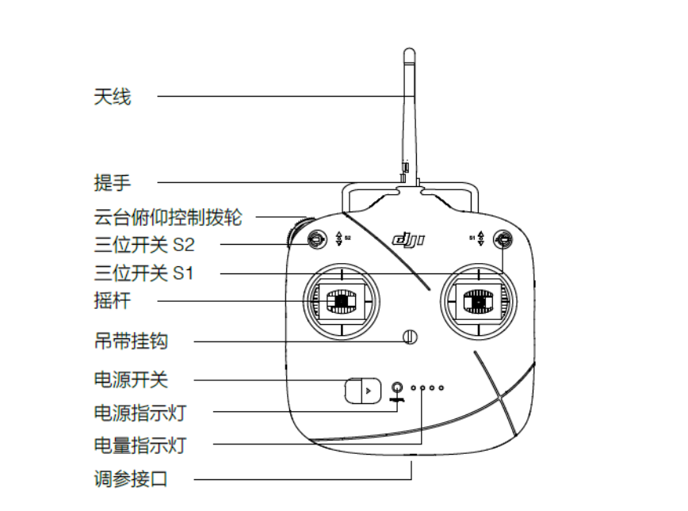

# RobotWarrior_Infantry_24

## 24赛季步兵代码框架
- **start_task**:开始任务，在其中创建了每个任务，并分配优先级和内存
-  **chasis_task**:底盘运动任务，在其中完成麦轮运动解算和CAN数据发送
  **chasis_power_control**：控制底盘功率，其中当前功率和限制功率从裁判系统中读出，当没有接入裁判系统时，请将chasis_task函数中的chasis_power_control函数注释
  **chasis_behavior**:设置底盘运动状态机，通过遥控器档位判断当前底盘的运动模式
  ```c
  typedef enum
{
  CHASSIS_ZERO_FORCE,                  //底盘无力
  CHASSIS_NO_MOVE,                     //底盘保持不动
  CHASSIS_INFANTRY_FOLLOW_GIMBAL_YAW,  //正常步兵底盘跟随云台
  CHASSIS_NO_FOLLOW_YAW,               //底盘不跟随角度，角度是开环的，但前后左右是有速度环
  CHASSIS_OPEN,                        //遥控器的值乘以比例直接发送到can总线上

  CHASSIS_ROTATION,                    //底盘小陀螺
  CHASSIS_ROTATION_EXIT,               //小陀螺退出状态机
} chassis_behaviour_e;
```
  
  
- **gimbal_task**:云台运动任务，在其中完成了对云台yaw轴和pitch轴的控制
  **gimbal_behavior**:设置云台运动状态机
```c
typedef enum
{
  GIMBAL_ZERO_FORCE = 0, //云台无力
  GIMBAL_INIT,           //云台初始化
  GIMBAL_CALI,           //云台校准
  GIMBAL_ABSOLUTE_ANGLE, //云台陀螺仪绝对角度控制
  GIMBAL_RELATIVE_ANGLE, //云台电机编码值相对角度控制
  GIMBAL_MOTIONLESS,     //云台在遥控器无输入一段时间后保持不动，避免陀螺仪漂移

  GIMBAL_AUTO_SHOOT,     //云台射击自动瞄准
} gimbal_behaviour_e;
```
- **refree_usart_task**:对裁判系统发来的数据进行解包（uart6），其中裁判系统协议在**APP/referee_task/refree.c**中，若新版裁判系统协议更改，可仿照之前代码直接添加/修改结构体，并重新memcpy
其中目前我们使用到的裁判系统数据如下：
```c
//获取底盘功率和剩余缓冲能量
extern void get_chassis_power_and_buffer(fp32 *power, fp32 *buffer);
//获取底盘功率上限
extern void get_chassis_power_limit(fp32 *power_limit);
//获取机器人ID
extern uint8_t get_robot_id(void);
//17mm枪口1热量上限及当前热量
extern void get_shoot_heat0_limit_and_heat0(uint16_t *heat0_limit, uint16_t *heat0);
//17mm枪口2热量上限及当前热量
extern void get_shoot_heat1_limit_and_heat1(uint16_t *heat1_limit, uint16_t *heat1);
//电源模块输出开关状态
extern uint8_t get_shoot_power_status(void);
//17mm枪口射速上限，24赛季后，枪口射速统一为30m/s，所以直接return 30；（shoot.c中我懒得改了）
extern uint8_t get_shoot_17mm_speed_limit(void);
```

- **remote_control**：将遥控器数据进行解包，并将数据存入rc_ctrl指针所指向结构体，可用**get_remote_control_point()** 来获取该指针地址，其中键盘数据也是通过遥控器转发，在完整形态考核的备赛阶段，由于大疆不借裁判系统，而我们也买不起，可能体会不到键盘数据的问题。经过我实测，键盘的数据经常会有丢帧的情况出现，而且较为严重，非常影响比赛。我有一个猜想，可能是按键按下后，确实被遥控器转发了，但是任务的调度没有调度到这个任务，导致没有得到应有的效果。我觉得如果在接收中断中，直接将状态机改变，只做简单的判断和改变，应该能满足中断快进快出的需求，不会影响系统运行，同时也能够保证不丢帧。
- **ROS_Receive**：与上位机进行通信，若是仅有自瞄信息，接收和发送数据为三个：yaw，pitch，占位;并在其中TIM8定时中断中，不断发给上位机c板imu的yaw,pitch信息，通信协议规定如下：
   1. sendBuff[0]~sendBuff[2] 帧头: 0x42,地址: 0x21,帧长： 13（目前为13，如果需要修改，记得喊算法组的厚密看看上位机需不需要修改）
   2. sendBuff[3]~sendBuff[11]: 数据位
   3. sendBuff[12] 校验位，目前使用和校验
   4. 
同时在ROS_Receive中还完成了相机硬触发的设置，相机硬触发代码在hardware/camera_trigger.c中，有兴趣的话可以看看
- **shoot**：在其中完成射击任务,其中shoot状态机如下：
```c
typedef enum
{
    SHOOT_STOP = 0,         //停止射击，摩擦轮停止转动
    SHOOT_READY_FRIC,       //摩擦轮启动，直到达到指定转速，软件自动进入SHOOT_READY
    SHOOT_READY,            //摩擦轮热身完毕 
    SHOOT_BULLET,           //射击
    SHOOT_CONTINUE_BULLET,  //持续射击
} shoot_mode_e;
```
当切换开关后，会先设置为SHOOT_READY_FRIC，此时摩擦轮转速缓缓提升（在24赛季中，我作为步兵操作手，明显可以感觉摩擦轮启动速度过于缓慢）。当摩擦轮达到设定速度后，才会将状态机设置成SHOOT_READY。由于23赛季学长的时间紧迫，所以摩擦轮使用的是pwm驱动c620电调，无法得到反馈，这赛季比赛前也没有充分测试，赛场上发现了两个问题：
1. 射速无法达到上限，我已经将脉宽设置为1990，（最大为2000，但是会进入校准模式），射速仍只有22~23左右
2. 摩擦轮开启速度太慢，面对湖南大学的小组赛时，我才刚从补给区出来打开摩擦轮的阶段，对面已经突到我的脸上把我秒了，甚至没有还手能力，而且好几次面对平衡步兵时，我有机会在侧身直接攻击其装甲板，但是由于摩擦轮开启速度太慢而措施机会

我在这里强烈建议下一届的学弟将其换成can来控制，如果can1总线上挂载太多，可以使用can2或者是关闭电调上所有的终端电阻

- **user_task**：调试用，直接在里面用串口打印想要的数据即可，提供有大部分控制结构体的指针
- **calibrate_task**：校准设备，主要使用到的是校准底盘，新车装好后，需重新校准前进方向
```c
  /*
  ==============================================================================
  *             使用遥控器进行开始校准
  *             第一步:遥控器的两个开关都打到下
  *             第二步:两个摇杆打成\../,保存两秒.\.代表左摇杆向右下打.
  *             第三步:摇杆打成./\. 开始陀螺仪校准
  *                    或者摇杆打成'\/' 开始云台校准
  *                    或者摇杆打成/''\ 开始底盘校准
  *
  *             数据在flash中，包括校准数据和名字 name[3] 和 校准标志位 cali_flag
  *             例如head_cali有八个字节,但它需要12字节在flash,如果它从0x080A0000开始
  *             0x080A0000-0x080A0007: head_cali数据
  *             0x080A0008: 名字name[0]
  *             0x080A0009: 名字name[1]
  *             0x080A000A: 名字name[2]
  *             0x080A000B: 校准标志位 cali_flag,当校准标志位为0x55,意味着head_cali已经校准了
  *             添加新设备
  *             1.添加设备名在calibrate_task.h的cali_id_e, 像
  *             typedef enum
  *             {
  *                 ...
  *                 //add more...
  *                 CALI_XXX,
  *                 CALI_LIST_LENGHT,
  *             } cali_id_e;
  *             2. 添加数据结构在 calibrate_task.h, 必须4字节倍数，像
  *
  *             typedef struct
  *             {
  *                 uint16_t xxx;
  *                 uint16_t yyy;
  *                 fp32 zzz;
  *             } xxx_cali_t; //长度:8字节 8 bytes, 必须是 4, 8, 12, 16...
  *             3.在 "FLASH_WRITE_BUF_LENGHT",添加"sizeof(xxx_cali_t)", 和实现新函数
  *             bool_t cali_xxx_hook(uint32_t *cali, bool_t cmd), 添加新名字在 "cali_name[CALI_LIST_LENGHT][3]"
  *             和申明变量 xxx_cali_t xxx_cail, 添加变量地址在cali_sensor_buf[CALI_LIST_LENGHT]
  *             在cali_sensor_size[CALI_LIST_LENGHT]添加数据长度, 最后在cali_hook_fun[CALI_LIST_LENGHT]添加函数
  *
  ==============================================================================
  @endverbatim
  ****************************RM Warrior 2023****************************
/*
校准顺序：
（上为前进方向）
4   3

1   2
```

- **UI_Task**：已写在ui_task.c最顶部注释中，请学弟自行查看

## 步兵操作指南（适用与英雄，或许哨兵也可以？）
1. **电源**：
  步兵的供电由大疆TB47/TB48供电，开机时需先短按电源键，然后长按，所有灯都长亮后代表电源正常开启，此时再打开旁边电池架上开关即可。
2. **裁判系统**：
  目前车上已经装好了裁判系统，若是直接上电，未开启裁判系统的调试模式，会导致不给C板上电，车无法控制。此时需进入裁判系统主控的菜单，找到调试设置，把其中的离线模式打开，静等一会大灯条变成黄色后，代表离线模式已经开启，C板上电。
3. **校准**：
  由于步兵和哨兵有3:1减速比的存在，适用电机编码器的校准方式可能出现3个中值的情况，在gimbalbehavior.c中有一个全局变量init_step的设定，若在定义时将其定义成0，则车在第一次上电时会向前冲一次，记录加速度来判断中值，这个地方需要调试，目前改过的步兵有些小bug（2024.4.12）所以不建议使用。我将其设置成了3，所以校准时会有一定概率出错，此时关闭电源再开启或是给c板重新烧录程序即可重新校准，大概率是对的。
4. **操控**：
  
  当机器人上电后，应保持遥控器S2处于中间档，S1处于最下方，下面将对每个部位进行讲解。
    
    1.  三位开关S1：最下档为无力状态，此刻所有控制功能无效，无法操控机器人；中间档位为云台跟随底盘模式，此时云台始终维持在中值状态，跟随底盘运动；最上的档位为底盘跟随云台模式，此时控制旋转为控制云台旋转，底盘再跟随，比赛中一般使用这个模式。
    1. 三位开关S2：正常状态下应在中间档位，向下拨一次后开启小陀螺（类似于上升沿下降沿，所以每次开关后需要将其拨回中间），向上拨一次开启自瞄（2024.4.12目前没有NX和摄像头，所以无效），代表状态是C板的黄灯常亮。
    1. 左摇杆：前后左右代表整个车身的前后左右。
    1. 右摇杆： 前后代表云台俯仰，向前云台向下，向后云台向上；左右代表旋转，具体旋转方式可参考S1中描述。
    1. 云台俯仰控制拨轮：向右转到底一次开启摩擦轮，摩擦轮开启需要预热，完全开启后向左拨一次会发射子弹，持续向左拨持续发弹（2024.4.12：不建议在向同学演示时发射子弹）。


<!-- ## 写在最后
作为24赛季电控组组长和步兵操作手，我对于本赛季的成果不是特别满意。
**关于组内方面：**
1. 我的任务安排不合理，不应该简单的将分组分为英雄/步兵/哨兵三个组，因为每个兵种的任务量完全不同，比如任务最少的英雄，在基本功能完成后，没能投入到其他两台车的研发，导致工期紧张。
2. 对于去年学长的代码，没有进行较大的优化，我们的工作可以看作是对于去年的复现和debug，加入的东西确实不多，哨兵除外，但是由于硬件问题，哨兵在最后一场中，没能正确的启动nx，算是一个遗憾吧
3. 对于大二的同学管理不完善，没能充分调动全体成员的能力来办事，这一点我就很羡慕机械组的成员，他们基本全员在线，都能干活的。下一届的电控组长可以向机械组取取经

**关于全队方面：**
1. 全队任务管理不够到位，没有一个类似项管的角色来对队伍统筹管理，队长在此方面有些欠缺
2. 在赛前没有合适的场地来练车，首先得有能跑的地方，实验室太小太乱了，这次甚至没有借到大创的实验室，我觉得真的有个场地的话，至少大家都能练练吧，不至于我们参加步兵对抗赛的队友，基本都是一次没练过车的；其次没有测发弹的地方，我之前天真的觉得把pwm波脉宽改成1990就没问题了，直到比赛才发现射速仍然只有23~24，且不够稳定
3. 全队整体开始工作的时间较晚，去年比完赛后到23年下半年，机械把所有的车给拆了，导致电控不能调，进而导致算法不能调，如果这赛季可以，我建议至少保留1到2台车，给充分的调试时间。当然，也有我们自身懈怠的原因，其实大部分工作也是从我大三上考完期末，搞完整形态考核的时候才开始，时间较晚。
RobotWarrior的24赛季告一段落了，这次比赛我们成功出了线，进入了16强，输给了湖北站冠军桂信科。但是说实话，能出线很大一部分原因是运气因素，我们比赛中真的出现了不少问题，包括英雄的卡弹，一侧摩擦轮不转；步兵校准中值；哨兵的自瞄开启和小陀螺速度过慢。
对于这次比赛而言，稳定性还是不行，下一届如果有机会，一定要将时间把握好，最晚最晚，留出两周的时间给练习比赛，包括各种操作，裁判端开启等平日里想不到的，但说操控这一点，鼠标操作和遥控器操作都是天差地别，很多地方调车的时候想不到，需要大量的测试练习来发现。 -->
最后，祝RobotWarrior25赛季大获全胜！